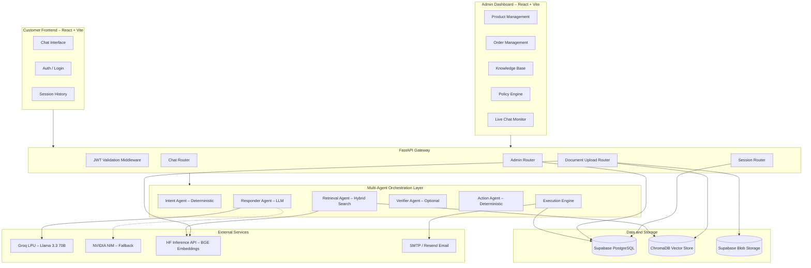
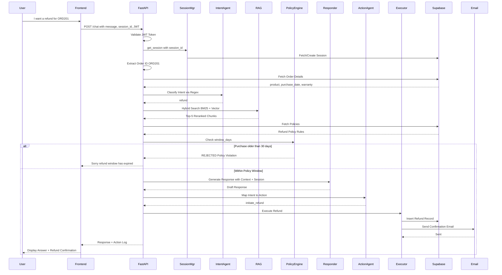
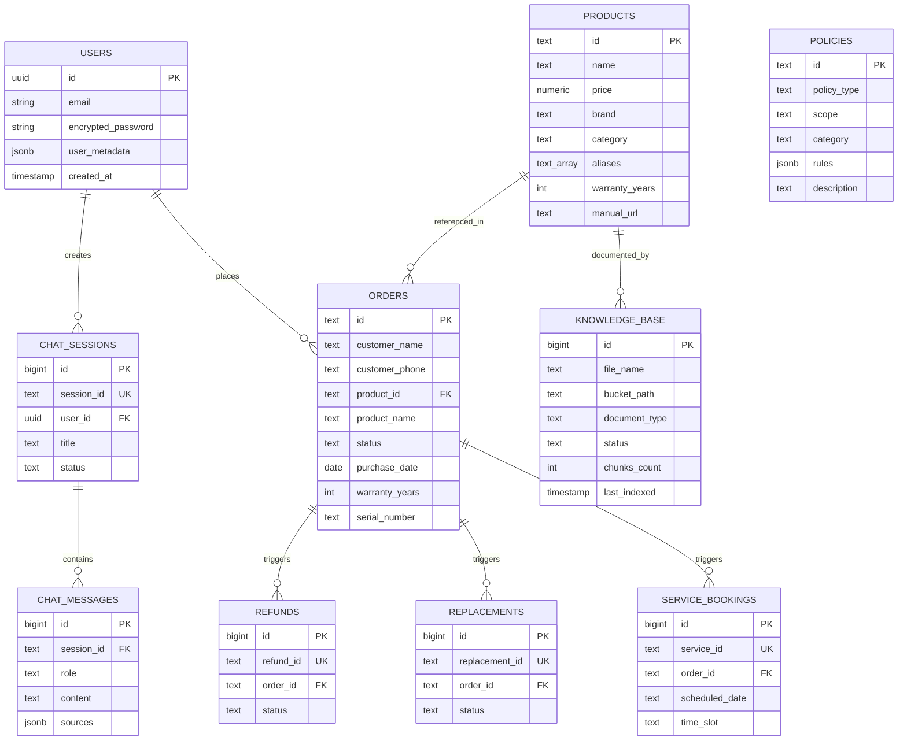
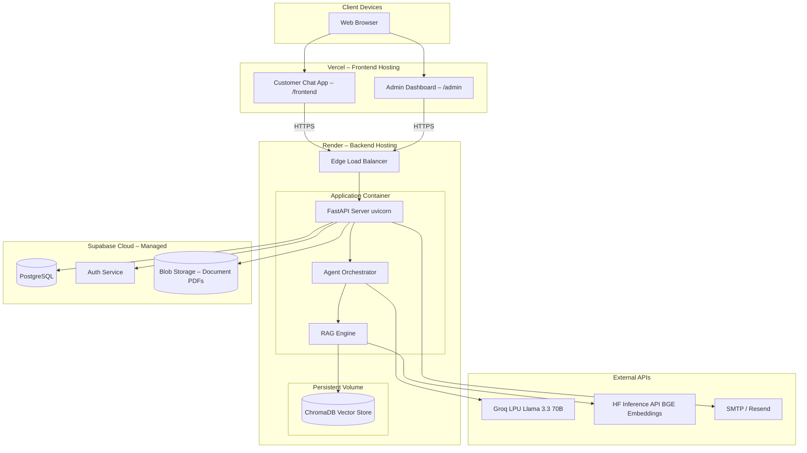

# AURA — AI-Powered Unified Response Agent
## Intelligent Customer Support System with RAG, Multi-Agent Orchestration & Automated Actions

<p align="center">
  
  
  
  
  
  
  
</p>

---

AURA is a production-grade, AI-powered customer support platform that goes far beyond a simple chatbot. It combines **Retrieval-Augmented Generation (RAG)** with a **multi-agent orchestration pipeline** and **deterministic action execution** to provide accurate, context-grounded answers from product manuals while autonomously processing refunds, replacements, and service bookings — all enforced by configurable business policies.

### ✨ Key Highlights

- 🤖 **Multi-Agent Pipeline** — Intent → RAG → Responder → Action → Execution (only 1 LLM call per request)
- 📄 **Knowledge-Grounded Answers** — Hybrid BM25 + Vector search with Reciprocal Rank Fusion eliminates hallucination
- ⚡ **Sub-2s Response Times** — Groq LPU inference + deterministic intent classification + LLM response caching
- 🔒 **Deterministic Policy Enforcement** — Refund/replacement windows enforced programmatically, not by the LLM
- 📧 **Automated Email Notifications** — Transactional emails via SMTP or Resend API on every action
- 🛡️ **Enterprise Auth** — Supabase Auth with JWT validation, Row-Level Security (RLS), and role-based admin access
- 📊 **Full Admin Dashboard** — Manage products, orders, policies, knowledge base, and monitor live conversations

---

## System Architecture Design

Below is the comprehensive architectural design for the AURA platform.

---

### 1. Component Diagram

This diagram illustrates the high-level boundaries between the Customer Frontend, Admin Dashboard, API Gateway, Agent Orchestration Layer, Data Storage, and External Providers.



---

### 2. Data Flow Diagram

Visualizes the complete lifecycle of a user message through the multi-agent pipeline.

```mermaid
graph LR
    User(["Customer"]) -->|1. Sends Message| API(FastAPI)
    API -->|2. Load/Create Session| SessionMgr(Session Manager)
    SessionMgr -->|3. Check for Order ID| OrderLookup(Order Lookup)
    OrderLookup -->|4. Fetch from DB| Supabase[("Supabase")]

    API -->|5. Classify Intent| IntentAgent["Intent Agent Regex ‒ No LLM"]
    IntentAgent -->|6. Should Use RAG?| RAGDecision{RAG Needed?}

    RAGDecision -->|Yes| QueryExp["Query Expansion LLM-assisted"]
    QueryExp -->|7. Hybrid Search| BM25["BM25 Keyword Index"]
    QueryExp -->|7. Hybrid Search| VectorDB["ChromaDB via HF API"]
    BM25 -->|8. Reciprocal Rank Fusion| Fusion[RRF Merger]
    VectorDB -->|8. Reciprocal Rank Fusion| Fusion
    Fusion -->|9. Rank Top-K| RerankerNode["RRF Weighted Ranking"]

    RAGDecision -->|No ‒ Greeting/Short| DirectResp[Skip to Responder]

    RerankerNode -->|10. Context + Policies| Responder["Responder Agent ‒ 1 LLM Call"]
    DirectResp --> Responder
    Responder -->|11. Decide Action| ActionAgent["Action Agent ‒ Deterministic"]
    ActionAgent -->|12. Execute| Executor[Action Executor]
    Executor -->|13. Notify| EmailService["Email Service"]
    Executor -->|14. Persist| Supabase
    Executor -->|15. Return Response| User
```



---

### 3. Sequence Diagram — Full Agent Pipeline

Demonstrates the real-time interaction for a customer requesting a refund with policy enforcement.



---

### 4. Database Schema (ER Diagram)

Entity-Relationship diagram representing the relational data in Supabase PostgreSQL. Vector embeddings reside in ChromaDB.



---

### 5. API Reference

> **Auth:** All endpoints (except `/health`) require a Bearer JWT obtained from Supabase Auth. Admin endpoints additionally require `is_admin` user metadata or inclusion in the `ADMIN_EMAILS` allowlist.

| Method | Endpoint | Auth | Description |
|--------|----------|------|-------------|
| `POST` | `/chat` | User | Send a message through the agent pipeline |
| `GET` | `/sessions` | User | List all chat sessions for the authenticated user |
| `GET` | `/sessions/{id}/messages` | User | Retrieve message history for a session |
| `PUT` | `/sessions/{id}` | User | Update session title |
| `DELETE` | `/sessions/{id}` | User | Delete a chat session |
| `POST` | `/admin/upload` | Admin | Upload PDF/DOCX/PPTX to the knowledge base |
| `GET` | `/admin/upload/status/{job_id}` | Admin | Check document ingestion status |
| `GET` | `/admin/products` | Admin | List all products |
| `POST` | `/admin/products` | Admin | Create a new product |
| `PUT` | `/admin/products/{id}` | Admin | Update a product |
| `DELETE` | `/admin/products/{id}` | Admin | Delete a product |
| `GET` | `/admin/orders` | Admin | List all orders |
| `POST` | `/admin/orders` | Admin | Create an order |
| `PUT` | `/admin/orders/{id}` | Admin | Update an order |
| `DELETE` | `/admin/orders/{id}` | Admin | Delete an order |
| `POST` | `/admin/import-orders` | Admin | Bulk import orders from XLSX/JSON |
| `GET` | `/admin/policies` | Admin | List all policies |
| `POST` | `/admin/policies` | Admin | Create a policy |
| `PUT` | `/admin/policies/{id}` | Admin | Update a policy |
| `DELETE` | `/admin/policies/{id}` | Admin | Delete a policy |
| `GET` | `/admin/knowledge` | Admin | List all knowledge documents |
| `DELETE` | `/admin/knowledge/{id}` | Admin | Delete a knowledge document |
| `GET` | `/admin/live/sessions` | Admin | List active chat sessions (live monitor) |
| `GET` | `/admin/live/sessions/{id}` | Admin | Get messages for a live session |

---

### 6. Deployment Architecture

Containerized deployment with managed cloud services for scalability and zero-downtime redeploys.



---

### 7. Folder Structure

```text
AURA/
├── backend/                          # Python FastAPI Backend
│   ├── __init__.py                   # Package marker
│   ├── main.py                       # FastAPI app entry point, all routes
│   ├── orchestrator.py               # Multi-agent pipeline coordinator
│   ├── agents.py                     # Intent, Retrieval, Responder, Verifier, Action agents
│   ├── rag.py                        # RAG engine (HF API embeddings, ChromaDB, BM25, RRF)
│   ├── llm_client.py                 # Unified LLM interface (Groq/NVIDIA) with caching
│   ├── session_manager.py            # Chat session state and Supabase persistence
│   ├── order_lookup.py               # Order ID extraction and DB lookup
│   ├── supabase_client.py            # Supabase wrapper (products, orders, policies, RLS)
│   ├── notifications.py              # Email notification service (SMTP/Resend)
│   ├── chroma_db/                    # ChromaDB persistent vector storage
│   └── data/                         # Local action logs (refunds, replacements, bookings)
│
├── frontend/                         # Customer-Facing Chat (React 19 + Vite)
│   ├── src/
│   │   ├── App.jsx                   # Root component with auth routing
│   │   ├── api.js                    # Backend API client functions
│   │   ├── main.jsx                  # React entry point
│   │   ├── index.css                 # Global styles (design system, responsive, animations)
│   │   ├── components/
│   │   │   ├── Auth.jsx              # Login / signup form
│   │   │   ├── ChatWindow.jsx        # Main chat UI with session sidebar
│   │   │   ├── MessageBubble.jsx     # Individual message renderer
│   │   │   ├── ActionCard.jsx        # Action result display cards
│   │   │   ├── ConfirmModal.jsx      # Bottom-sheet modal (mobile) / centered (desktop)
│   │   │   ├── SourceChip.jsx        # Source citation chips
│   │   │   └── TypingIndicator.jsx   # Bot typing animation
│   │   └── lib/
│   │       └── supabase.js           # Supabase client initialization
│   ├── vercel.json                   # SPA routing rewrites for Vercel
│   └── index.html
│
├── admin/                            # Admin Dashboard (React 19 + Vite)
│   ├── src/
│   │   ├── App.jsx                   # Root with sidebar navigation
│   │   ├── main.jsx                  # React entry point
│   │   ├── index.css                 # Admin theme styles
│   │   ├── components/
│   │   │   ├── Auth.jsx              # Admin login
│   │   │   ├── Sidebar.jsx           # Navigation sidebar
│   │   │   ├── StatCard.jsx          # Dashboard metric cards
│   │   │   ├── UploadZone.jsx        # Drag-and-drop file uploader
│   │   │   ├── ChatFeed.jsx          # Live chat message feed
│   │   │   └── ConfirmModal.jsx      # Delete confirmation modal
│   │   ├── pages/
│   │   │   ├── Dashboard.jsx         # Overview stats + order import
│   │   │   ├── Knowledge.jsx         # Knowledge base management
│   │   │   ├── Inventory.jsx         # Product CRUD
│   │   │   ├── Orders.jsx            # Order CRUD + filtering
│   │   │   ├── Policies.jsx          # Policy engine configuration
│   │   │   └── LiveCenter.jsx        # Real-time chat monitoring
│   │   └── lib/
│   │       └── supabase.js           # Supabase client initialization
│   ├── vercel.json                   # SPA routing rewrites for Vercel
│   └── index.html
│
├── .env.example                      # Environment variable template
├── Dockerfile                        # Production container (Python 3.11 slim)
├── .dockerignore                     # Docker build exclusions
├── requirements.txt                  # Python dependencies
├── supabase_schema.sql               # Complete idempotent DB schema
└── README.md                         # This file
```

---

### 8. Design Justifications

**1. Multi-Agent Architecture with Minimal LLM Calls**

The system employs a pipeline of specialized agents, but is architected to use only **1 LLM call per user message** (the Responder). Intent classification is fully deterministic (regex/keyword), action mapping is a static dictionary lookup, and confirmation messages use predefined templates. This reduces latency by ~70% and cost by ~75% compared to naive multi-LLM-call architectures.

**2. Hybrid RAG with 4-Stage Retrieval**

Rather than relying solely on vector similarity, AURA implements a sophisticated 4-stage retrieval pipeline:
1. **LLM-based Query Expansion** — Rewrites the user query with alternative terminology
2. **BM25 Keyword Search** — Captures exact term matches that embeddings might miss
3. **Vector Similarity Search** — ChromaDB cosine similarity over BGE embeddings (via HF Inference API — zero local RAM)
4. **Reciprocal Rank Fusion (RRF)** — Merges BM25 and vector results into a weighted unified ranking

The HF Inference API approach eliminates the need for local PyTorch/sentence-transformers, reducing server RAM from ~600MB to ~100MB while maintaining full embedding quality. This hybrid approach consistently outperforms pure vector search, especially for product-specific technical queries containing model numbers and error codes.

**3. Deterministic Policy Enforcement**

Business-critical rules (refund window, replacement eligibility) are **never delegated to the LLM**. The orchestrator programmatically checks `purchase_date` against `policy.rules.window_days` and short-circuits the pipeline with a rejection message if the policy is violated. This eliminates the risk of an LLM hallucinating a policy exception.

**4. Hallucination Reduction Framework**

Multiple layers of defense prevent the AI from fabricating information:
- **Grounded System Prompt** — The responder is explicitly instructed to only use provided context and cite sources
- **Citation Enforcement** — The prompt demands document name + page number for every factual claim
- **Optional Verifier Agent** — A second LLM pass (disabled by default) cross-checks the draft against the retrieved chunks
- **RAG Skip Logic** — Greetings and short acknowledgments bypass RAG entirely, preventing irrelevant context injection
- **LLM Response Cache** — Identical queries return cached responses, ensuring consistency

**5. Session-Aware Conversational State**

Unlike stateless Q&A bots, AURA maintains a rich session state that persists across messages:
- Extracts and remembers Order IDs from natural language ("my order ORD201")
- Carries forward customer name, product, warranty status, and pending actions
- Inherits intent from previous turns when the user provides follow-up information
- Persists sessions to Supabase so conversations survive server restarts

**6. Enterprise-Grade Security**

- **Supabase Auth** with email/password authentication and JWT tokens
- **Row-Level Security (RLS)** — User-scoped Supabase clients ensure customers can only see their own sessions
- **Admin Authorization** — Dual-layer check: `user_metadata.is_admin` flag + `ADMIN_EMAILS` env-var allowlist
- **Input Sanitization** — PyMuPDF explicitly prevents execution of embedded scripts in uploaded PDFs
- **Secrets Management** — All credentials injected via environment variables, never committed to git

**7. Multi-Format Document Ingestion**

The knowledge base accepts PDF, DOCX, and PPTX uploads with:
- **PyMuPDF** for superior PDF text extraction with reading-order preservation
- **Tesseract OCR** fallback for scanned/image-based PDF pages
- **Token-based chunking** with configurable size and overlap
- **Page-level metadata** — Every chunk carries its source filename and page number for precise citations
- **Background processing** — Ingestion runs in a ThreadPoolExecutor (3 workers) with progress tracking via job IDs

---

## Getting Started

### Prerequisites

- **Python 3.11+**
- **Node.js 18+**
- A free [Supabase](https://supabase.com) project
- A free [Groq](https://console.groq.com) API key
- A free [Hugging Face](https://huggingface.co/settings/tokens) access token (for remote embeddings)

### 1. Clone and Configure

```bash
git clone https://github.com/your-username/AURA.git
cd AURA

# Create .env from template
cp .env.example .env
# Fill in your GROQ_API_KEY, HF_TOKEN, SUPABASE_URL, SUPABASE_ANON_KEY, SUPABASE_SERVICE_ROLE_KEY
```

### 2. Set Up the Database

Go to your Supabase Dashboard, open the SQL Editor, paste the contents of `supabase_schema.sql`, and run it.

### 3. Start the Backend

```bash
python -m venv venv
source venv/bin/activate   # Windows: venv\Scripts\activate
pip install -r requirements.txt

uvicorn backend.main:app --reload
```
The API will be live at `http://localhost:8000`.

### 4. Start the Customer Frontend

```bash
cd frontend
npm install
npm run dev
```
Open `http://localhost:5173`.

### 5. Start the Admin Dashboard

```bash
cd admin
npm install
npm run dev
```
Open `http://localhost:5174`.

---

## Tech Stack

| Layer | Technology | Purpose |
|-------|-----------|---------|
| **LLM Inference** | Groq (Llama 3.3 70B) | Ultra-fast response generation via LPU |
| **LLM Fallback** | NVIDIA NIM | Secondary provider for resilience |
| **Embeddings** | HF Inference API (BGE) | Remote, free semantic embeddings via Hugging Face |
| **Reranker** | Reciprocal Rank Fusion | BM25 + Vector hybrid ranking (zero local RAM) |
| **Vector Store** | ChromaDB | Persistent vector database |
| **Keyword Search** | BM25 (rank-bm25) | Complementary lexical retrieval |
| **Database** | Supabase PostgreSQL | Relational data + Auth + Blob Storage |
| **Backend** | FastAPI + Uvicorn | Async Python API server |
| **Frontend** | React 19 + Vite | Customer chat and Admin dashboard |
| **Styling** | Tailwind CSS v4 | Utility-first CSS framework |
| **Email** | SMTP / Resend | Transactional notification delivery |
| **Containerization** | Docker | Production deployment packaging |
| **Hosting** | Render + Vercel | Backend (Render) + Frontend (Vercel) |

---

## Environment Variables

| Variable | Required | Description |
|----------|----------|-------------|
| `LLM_PROVIDER` | Yes | `groq` (default) or `nvidia` |
| `GROQ_API_KEY` | Yes | Your Groq API key |
| `SUPABASE_URL` | Yes | Your Supabase project URL |
| `SUPABASE_ANON_KEY` | Yes | Supabase anon/public key |
| `SUPABASE_SERVICE_ROLE_KEY` | Yes | Supabase service role key |
| `EMBEDDING_MODEL` | No | Default: `BAAI/bge-base-en-v1.5` |
| `HF_TOKEN` | Yes (cloud) | Hugging Face API token for remote embeddings |
| `RERANKER_MODEL` | No | Default: `cross-encoder/ms-marco-MiniLM-L-6-v2` (skipped in API mode) |
| `SMTP_HOST` | No | Email server host (default: `smtp.gmail.com`) |
| `SMTP_USERNAME` | No | Email account username |
| `SMTP_PASSWORD` | No | Email account app password |
| `ADMIN_EMAILS` | No | Comma-separated admin email allowlist |
| `ENABLE_VERIFIER` | No | Enable response verification (default: `false`) |
| `ENABLE_QUERY_EXPANSION` | No | Enable LLM query expansion (default: `true`) |
| `ENABLE_HYBRID_SEARCH` | No | Enable BM25+Vector hybrid (default: `true`) |

---

## License

This project is proprietary. All rights reserved.

---

<p align="center">
  Built with care by <strong>Mohammed Kaif</strong>
</p>
