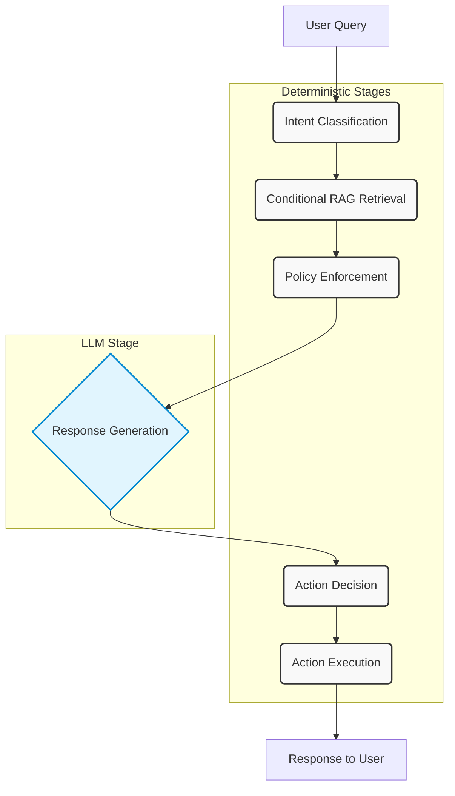

# AURA

An agentic customer-support backend that executes real business actions under deterministic policy enforcement.

[](https://opensource.org/licenses/MIT)
[](https://python.org)
[](https://fastapi.tiangolo.com)
[]()

AURA is an agentic customer-support backend designed to not just answer questions, but execute real business actions—refunds, replacements, and service bookings. Unlike generic RAG chatbots, AURA is built around deterministic policy enforcement: intent classification, policy checks, and action execution happen strictly in Python code, meaning the system cannot be prompt-engineered or hallucinated into authorizing an invalid return.

**[]()** <!-- TODO: Replace placeholder URL with the actual deployed URL -->

<!-- TODO: Insert a screenshot or GIF of the AURA chat interface answering a product question here -->

---

## Table of Contents

- [Architecture](#architecture)
- [Tech Stack](#tech-stack)
- [Key Engineering Decisions](#key-engineering-decisions)
- [Local Development Setup](#local-development-setup)
- [Known Limitations](#known-limitations)
- [License & Contact](#license--contact)

---

## Architecture

AURA relies on a multi-stage pipeline where only one stage generates an open-ended LLM response. The rest of the pipeline is gated by deterministic business logic.


```mermaid
flowchart TD
    A[User Query] --> B(Intent Classification)
    
    subgraph Deterministic Stages
    B --> C(Conditional RAG Retrieval)
    C --> D(Policy Enforcement)
    F(Action Decision) --> G(Action Execution)
    end
    
    subgraph LLM Stage
    D --> E{Response Generation}
    E --> F
    end

    G --> H[Response to User]
    
    classDef deterministic fill:#f9f9f9,stroke:#333,stroke-width:2px;
    classDef llm fill:#e1f5fe,stroke:#0288d1,stroke-width:2px;
    
    class B,C,D,F,G deterministic;
    class E llm;
```

1. **Intent Classification (Deterministic)**: Maps the user's query to a hard-coded intent (e.g., `troubleshoot`, `refund`, `product_information`).
2. **Conditional RAG Retrieval (Deterministic)**: Fetches relevant manual chunks and exact policy guidelines based on the intent.
3. **Policy Enforcement (Deterministic)**: Evaluates strict business rules (e.g., "Is the product within the 30-day window?") in Python.
4. **Response Generation (LLM)**: Uses the retrieved context and the outcome of the policy checks to draft a human-friendly response.
5. **Action Decision (Deterministic)**: Checks the state graph to verify if an action should be triggered.
6. **Action Execution (Deterministic)**: Triggers real backend database updates for refunds, service bookings, etc.

*Note: The project currently includes two orchestrator implementations: the original `orchestrator.py` and a LangGraph-based `StateGraph` version (`orchestrator_graph.py`) offering robust checkpointing for conversation resumability. This is an active architectural exploration, but both are fully functional.*

---

## Tech Stack

### LLM / Inference


### Retrieval / Vector Store


### Backend Framework & Database


### Orchestration


---

## Key Engineering Decisions

### Deterministic Policy Enforcement
**Problem:** Relying on an LLM to enforce business rules (e.g., "Don't issue a refund after 30 days") leaves the system vulnerable to prompt injection and hallucinations, creating unacceptable financial risk.  
**Solution:** AURA enforces policies via hardcoded Python checks before the LLM ever sees the prompt.  
**Result:** The risk of unauthorized financial actions is structurally eliminated, as the LLM has no authority to override the Python state machine.

### Local to API-Inference Migration
**Problem:** The backend originally relied on locally-loaded ML models (`sentence-transformers` and `torch`) for embeddings and reranking, causing the Docker image to exceed 2GB+ and requiring far more RAM than free-tier hosting limits allow (e.g., Render's 512MB limit).  
**Solution:** Migrated completely to the Hugging Face Inference API for both embeddings and cross-encoder reranking.  
**Result:** The Docker image size dropped to roughly 500MB, allowing AURA to deploy and run comfortably on highly constrained serverless hosts.

### Chroma Cloud Migration
**Problem:** The local-disk version of ChromaDB is incompatible with ephemeral filesystems (like Render or Railway), wiping the index every time the container restarts.  
**Solution:** Migrated the vector database entirely to Chroma Cloud.  
**Result:** The system maintains a durable, persistent hosted vector store that survives container restarts and scales independently of the API host.

### Reranker & Search Latency Debugging
**Problem:** During early load testing, retrieval took upwards of **210,000ms** per query due to a broken reranker payload structure retrying against a dead endpoint.  
**Solution:** Fixed the payload for cross-encoder batching, tuned HTTP timeouts against measured data, parallelized the Chroma variant queries via a ThreadPoolExecutor, capped the reranker at 10 candidates, and introduced a global LRU retrieval cache.  
**Result:** Retrieval latency dropped to **~3,400ms** for a fresh cold query, and **under 350ms** for a cached repeat query.

---

## Local Development Setup

### 1. Environment Variables
Create a `.env` file in the root directory and populate it with the keys outlined in `.env.example`. You will need:
- **Hugging Face API Token**
- **Chroma Cloud Credentials** (API Key, Tenant, Database)
- **Groq API Key**
- **Supabase Credentials** (URL, Anon Key, Service Role Key)

### 2. Run Locally
```bash
# Install dependencies
pip install -r requirements.txt

# Start the FastAPI backend
python -m uvicorn backend.main:app --reload --port 8000
```

---

## Known Limitations

- **Inference Variance**: Because AURA relies on the free-tier Hugging Face API for embeddings and reranking, occasional latency spikes (timeouts or cold-starts) are possible under load. The backend gracefully degrades to standard vector search if the reranker API times out.
- **Orchestrator Duality**: The LangGraph orchestrator exists alongside the original pipeline as an architectural exploration. It is not currently the default routing logic in the frontend endpoints.

---

## License & Contact

Distributed under the MIT License.

<!-- TODO: Insert Author Name / Contact Link (e.g., LinkedIn or Email) here if desired -->
