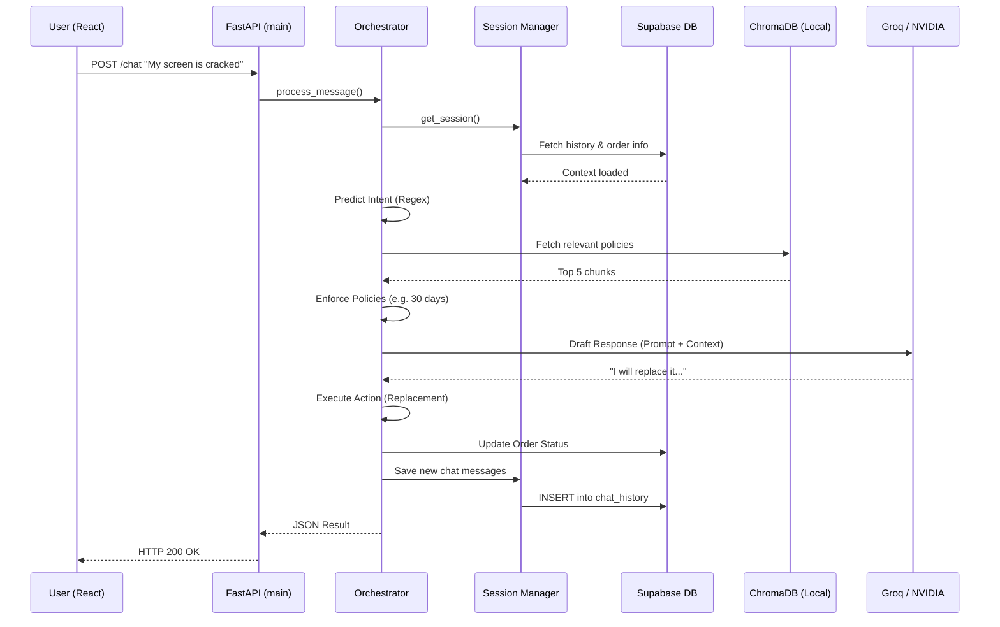

# AURA Backend Data Flow

> [!NOTE]
> This document provides a **step-by-step trace** of what happens when a user types a message in the frontend chat widget and presses "Send".

## The Message Journey

### Step 1: Frontend to API
- **Action:** User types `"My screen is cracked, Order #123"` and clicks Send.
- **Component:** `main.py` -> `@app.post("/chat")`
- **What happens:** The FastAPI server receives the JSON payload. It validates the input and forwards it to the Orchestrator.

### Step 2: Session Loading
- **Component:** `orchestrator.py` & `session_manager.py`
- **What happens:** 
  - The system checks if this is an existing conversation (`session_id`).
  - It loads past context from Supabase so the bot remembers what was said 5 minutes ago.
  - It checks if an Order ID (like `#123`) is mentioned and auto-fetches order details (Product Name, Purchase Date) via `order_lookup.py`.

### Step 3: Intent Classification (Deterministic)
- **Component:** `agents.py` -> `intent_agent()`
- **What happens:** 
  - Using fast Regex/Keywords, the agent tags the message.
  - `cracked` + `order` -> Intent: `replacement`.
  - *No LLM is used here to save time and money.*

### Step 4: Knowledge Retrieval (RAG)
- **Component:** `rag.py`
- **What happens:** 
  - The system queries ChromaDB (our local Vector Database) to see if we have a policy for screen replacements.
  - It fetches the Top 5 most relevant paragraphs from company manuals or policies.

### Step 5: Policy Enforcement
- **Component:** `orchestrator.py`
- **What happens:** 
  - The orchestrator checks hardcoded business logic. 
  - "Is this order within the 30-day warranty window?"
  - If NO: It bypasses the LLM and instantly replies, "Sorry, your warranty has expired."
  - If YES: It proceeds.

### Step 6: LLM Response Drafting
- **Component:** `agents.py` -> `responder_agent()`
- **What happens:** 
  - The system sends a massive prompt to the LLM (Groq/NVIDIA) containing:
    - The User's Message
    - The Past Conversation
    - The Order Details
    - The Retrieved Policy Text
  - The LLM drafts a polite, helpful response: *"I'm sorry your screen is cracked. I see your TV is still under warranty. I will initiate a replacement for you."*

### Step 7: Action Execution
- **Component:** `agents.py` -> `action_agent()` & `execute_action()`
- **What happens:** 
  - The system sees the intent was `replacement` and the LLM successfully drafted a response.
  - It triggers `execute_action()`, which updates the Order Status in Supabase to "Replacement Processing".
  - `notifications.py` fires off a confirmation email to the user.

### Step 8: Return to User
- **Component:** `orchestrator.py` -> `main.py`
- **What happens:** 
  - The final response, along with citations (where the bot got its information) and action logs, are packed into a JSON object.
  - The conversation is saved to Supabase.
  - The JSON is sent back to the React frontend to display in the UI.

## Flow Diagram

